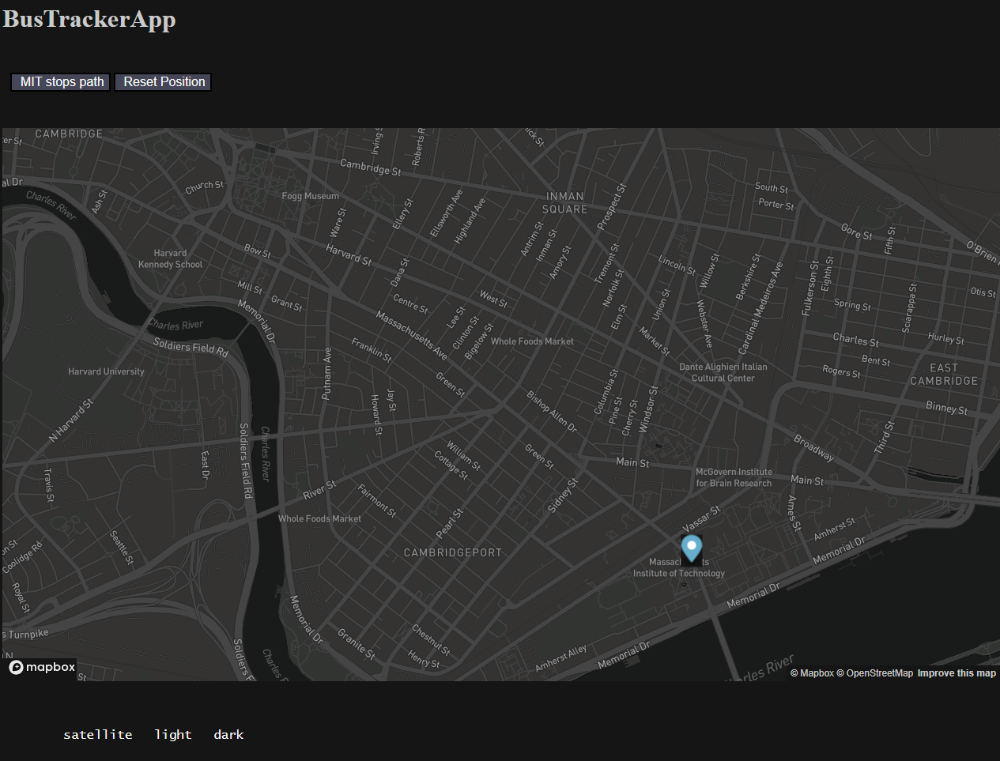

# Bus Tracker App

## Description
A web application that tracks the bus stops near the MIT campus using the MapBox API.

# How To Run

Download ALL the files within this repository and run the Index.html file in a web browser that supports JavaScript code.

# Road Map to Improvements
* Work on the UX/UI of the website because it looks awful so far.
